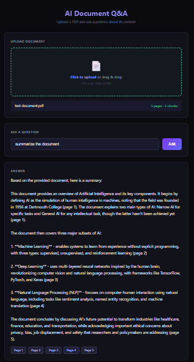

 
# 📄 AI Document Q&A

Upload any PDF and ask questions in plain English. Get instant answers with exact page references — powered by Claude AI.

---

## 🚀 What It Does

Stop reading 50-page documents to find one answer. Upload your PDF, ask your question, get the answer with the exact page it came from.

**You upload PDF → Ask a question → Get answer with page references in seconds.**

---

## ✨ Features

- **PDF Upload** — Drag and drop or click to upload, up to 50MB
- **Natural Language Questions** — Ask anything in plain English
- **Accurate Answers** — Claude answers only from your document
- **Page References** — Every answer includes which page(s) it came from
- **Honest Responses** — Says "I couldn't find that" instead of hallucinating
- **Dark UI** — Clean, professional interface

---

## 🏗️ How It Works (RAG Pipeline)

1. PDF uploaded → text extracted page by page
2. Text split into 500-word chunks with 50-word overlap
3. User asks a question
4. TF-IDF ranker finds the most relevant chunks
5. Top chunks + question sent to Claude API
6. Claude answers using only that context and cites page numbers

---

## 🛠️ Tech Stack

| Layer | Technology |
|---|---|
| Backend | Node.js + Express |
| AI | Anthropic Claude API |
| PDF Parsing | pdf-parse |
| Relevance Ranking | TF-IDF (custom implementation) |
| Frontend | HTML, CSS, Vanilla JS |

---

## ⚙️ Getting Started

### Prerequisites
- Node.js v18+
- Anthropic API key — get one at console.anthropic.com

### Installation

    git clone https://github.com/manasa-shivananda/ai-document-qa.git
    cd ai-document-qa
    npm install

### Configuration

Create a .env file:

    ANTHROPIC_API_KEY=your_api_key_here
    PORT=3000

### Run

    node server.js

Open http://localhost:3000 in your browser.

---

## 📸 Demo

---

## 🧠 What I Learned

- **RAG pipeline implementation** — chunking, relevance ranking, context injection
- **TF-IDF ranking** — scoring document chunks against user queries without a vector DB
- **PDF text extraction** — per-page extraction to enable accurate page citations
- **Prompt engineering** — instructing Claude to answer only from provided context
- **Claude API integration** — multi-turn context management and structured responses

---

## 🗺️ Roadmap

- [ ] Vector embeddings for better relevance matching
- [ ] Support for multiple documents
- [ ] Chat history (follow-up questions)
- [ ] Deploy to Railway/Render

---

## 👩‍💻 About

Built by [Manasa Shivananda](https://github.com/manasa-shivananda) — Full-Stack Developer specialising in AI-powered tooling.

**AI Portfolio Series:**
- Project 1: [AI Code Reviewer](https://github.com/manasa-shivananda/ai-code-reviewer)
- Project 2: AI Document Q&A (this project)

---

## 📄 License

MIT License
